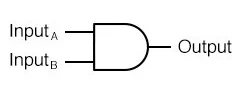
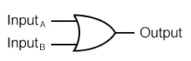
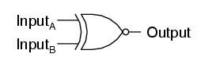

### Logic gates and Linux Pipeline (Norman Murray)

_2020-10-27 10:00:00 - 2020-10-27 10:50:00_

The basic components of computers are called Logic Gates. They do basic computation and the output is a boolean value (true 1 / false 0). Computers are made up of billions of Logic Gates in series.

_Editor's note: It's important to learn the following symbols for each gate._

#### AND gate

An AND gate takes two boolean values, if both values are `true` then the AND gate returns `true`, otherwise it returns false.

In the example above, if `InputA` and `InputB` are both `true`, then the output is `true`.

#### OR gate

An OR gate takes two boolean values, if either of the values are `true` (or both of them are `true`) then the OR gate returns `true`, otherwise it returns `false`.

In the example above, if either `InputA` or `InputB` are true, then the output is `true`.

#### NOT gate

The NOT gate reverse the input as the output. If it takes in a `true` it will output `false`, if it takes in `false` it will output `true`

#### Exclusive OR Gate

Exclusive OR (XOR) gates take two boolean values, if EXACTLY one of the values are `true` then the XOR gate returns `true`, otherwise it returns `false`.

In the above example, if both `InputA` and `InputB` are `true` or `false`, then the output is `false`

We can combine multiple gates together to make a complex logic circuit. Some examples of logic circuits which can be made by combining gates are: `NAND (Not AND)` and `NOR (Not OR)` gates.

#### Linux Pipelines

In previous lectures we've seen that we can run commands on the command line interface, some of the commands we've seen:

* `cat` get the contents of a file
* `find` search for a file
* `grep` search for text in a gile

We can use the pipe symbol `|` to pass the output from one command in to another and create a complex pipeline of commands to process data.

For example:

`cat example.text | grep banana`

The above command will get the content of the `example.txt` file and pipe it (send it) to the grep command, which will find all the lines in the file which contain the word "banana"
