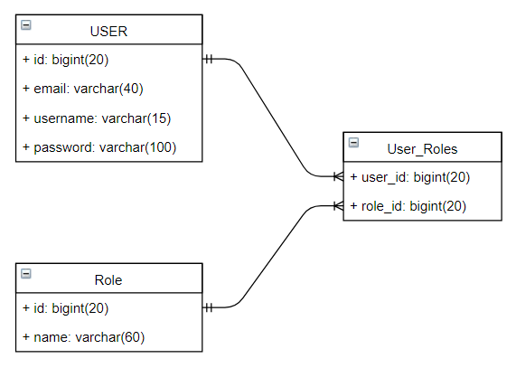

### Logical Database Models (Chris Bryant)

_2020-11-02 13:00:00 - 2020-11-02 13:50:00_

#### Transforming Entity-Relationship models in to a Relational model

* Each entity in the model becomes a table (with the same attributes and primary key)
* Each relationship transforms in to either
  * A new table linked by foreign keys
  * Or a new table, linked to by foreign keys
* Constraints become either:
  * Attribute constraints, or:
  * Table constraints

#### Choosin a foreign key

Foreign keys:

* Should not have multiple values
* Should not have null values
* Should be kept as simple as possible

Generally, the foreign key in an m:m (mandatory / mandatory table relation) can go in either table, and rarely in both.

If a foreign key has the possibility of null values if placed in either table in a relation, a third table should be created (a `pivot` table) which contains nothing except the foreign key values in the tables:

Here is an example `pivot` table which links together a `User` table and a `Role` table:

