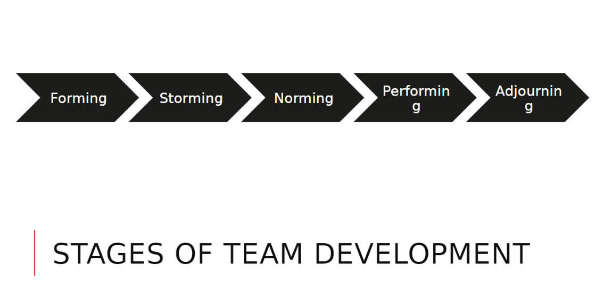

### Group work at university (Laura Milne)

_2020-09-16 12:00:00 - 2020-09-16 12:40:00_

There will be multiple group projects and they can cause a lot of conflict. Ask quiet people for input, get to know everyone and establish roles within the group.

Facilitator / Note-take / Timekeeper / Sceptic / Editor

Certain projects will have a provided git server for submitting work to, outside of those Bitbucket is good to be used.

Set up a conflict resolution process early on in the project.

De-escalate as soon as possible.

Stand-ups, scrum, kanban, etc.

The following is a good format to take for beginning and subsequently completing a project:

