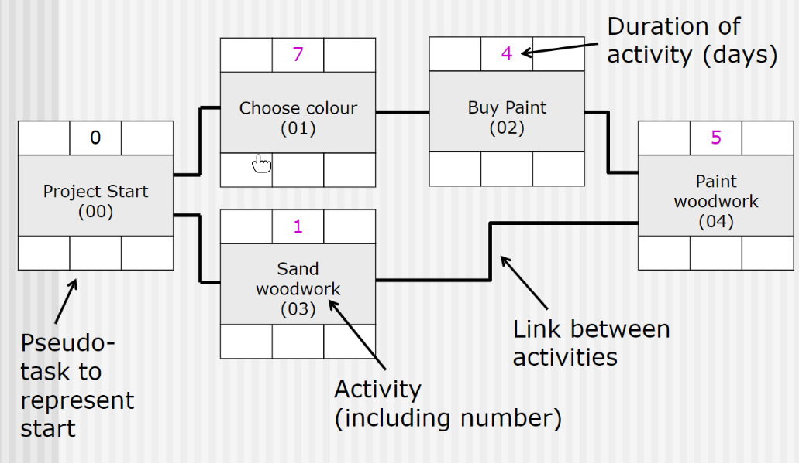

### Initial timescales, critical paths and resource scheduling (Nigel Linge)

_2020-10-26 10:00:00 - 2020-10-26 10:50:00_

#### Order of tasks

It isn't always enough to just know what you need to do, it's also important to know the order in which you need to do it.

Some activities are dependent on each other:

* You need to have your ingredients before you can bake a cake
* You need to have the money before you can purchase anything

It's important when planning to organise the order in which tasks will take place so that you can properly estimate how long the project will take.

Where possible, some tasks can happen at the same time:

* One person can be gathering ingredients while someone else buys a new oven dish
* One person can be withdrawing the money from the bank while the other person looks for the products to buy

This stage of project planning is called `scheduling`. A WBS (Work breakdown structure) is the plan which codifies this.

#### Gantt charts

One method of organising and scheduling tasks is a gantt chart.

There is a wikipedia article on [Gantt charts here.](https://en.wikipedia.org/wiki/Gantt_chart)

Gantt charts with lots of tasks or dependencies in them can become visually complex. Gantt charts work very well for simple projects, but as complexity increases Gantt charts become increasingly harder to understand.

#### Critical path networks

_Editor's note: This is a very visual lecture, I would recommend watching the recording of the lecture to understand CPNs._

Critical Path Networks are an easy way to display dependent tasks: tasks which rely on a lot of other tasks.

Critical path networks are essentially flow charts. A useful tool for drawing flowcharts is: [https://app.diagrams.net/](https://app.diagrams.net/)  

An example of a simple critical path network for a small painting project:

