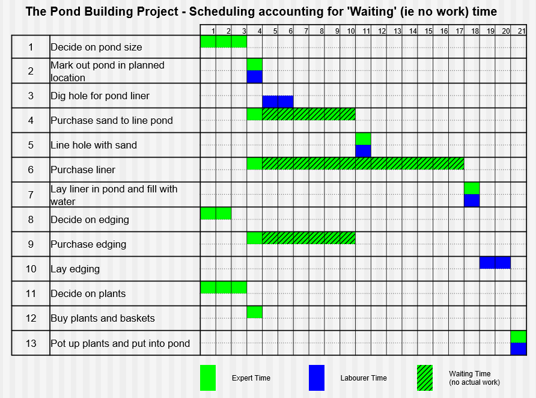

### Resource Requirements and Final Schedling (Laura Milne)

_2020-10-27 09:00:00 - 2020-10-27 09:50:00_

The main resources on projects are people, infrastructure and equipment.

People are the most complex and costly resource:

* Different people will take different amounts of time to complete tasks
* We have to account not only for time spint on tasks but also other time people need to do their jobs (checking emails, meetings, etc)
* Each person has experience using different tools or working on different projects

#### Resource requirements

A good way to organise tasks which need to be done is a gantt chart. Gantt charts can be useful when you have multiple people with different skills working on a task and you want to have them work as asynchronously as possible while ensuring that no member of the team will be "blocked" and unable to work.

Gantt charts can also account for "waiting time" when you are waiting on external factors (deliveries, responses from experts, etc)

There is a problem with the above chart: On days 1-4 more than one expert is required

#### Float

In a project, float is the amount of time that a task can be delayed without causing a delay to other tasks in the project.

There are two primary types of float:

##### Total Float

Total Float is the amount of time that a task can be delayed from its start date without delaying the project finish date

##### Free Float

Free Float is the amount of time that a task can be delayed without delaying the start date of a subsequent task

##### Negative float

Negative float happens when there is not enough time in a project (or before a task) to complete all the necessary work. The technical description is that "the critical project path cannot be completed by the required deadlines."

To reduce negative float you can reduce the following resources:

* Quality
* Cost

Or increase the following resource:

* Time available (by adding people)

Reducing negative float by reducing resources normally results in a worse end product.
